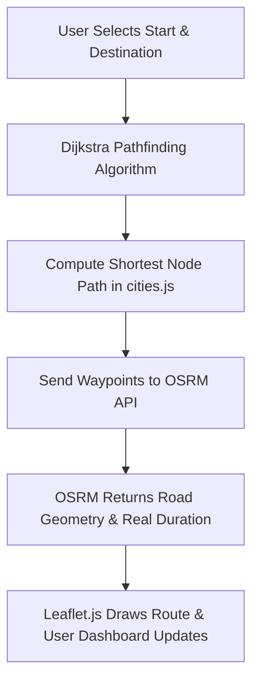

# Smart Route Finder Pakistan v2.0 🇵🇰 📍

An interactive, premium web-based navigation system that calculates the mathematically shortest driving route between **81+ Pakistani cities** using a custom client-side Dijkstra's algorithm, and maps real road geometries using the OSRM API and Leaflet.js.

---

## 📖 GitHub About Section (Repository Description)
> Find the shortest driving route between 81+ Pakistani cities using Dijkstra's algorithm, with real road geometry from OSRM and interactive Leaflet maps. Features Light/Dark mode, path tables, and custom toast alerts.

### Recommended Repository Topics (Tags)
`dijkstra-algorithm` · `route-finder` · `leaflet-maps` · `osrm-api` · `graph-theory` · `pakistan-navigation` · `interactive-map` · `javascript-es6` · `html5-css3`

---

## 🌟 Key Features

- **📍 Dijkstra's Weighted Graph**: Custom client-side pathfinding implementation. Cities are represented as graph nodes, and road connections are edges weighted by approximate driving distance.
- **🗺️ Leaflet.js Interactive Map**: Beautiful map rendering with custom hover tooltips, smooth zooming, and highlighted routes.
- **🛣️ OSRM Real Road Geometry**: Fetches exact road geometry (curves, turns, highways) from the Open Source Routing Machine (OSRM) API instead of drawing unrealistic straight lines.
- **⏱️ Driving Duration & Distance**: Real-time traffic-independent driving duration and physical distance calculations directly from OSRM.
- **📊 Interactive Graph Table**: Visualizes calculated route segments in a tabular format, supporting row-click highlights on the map.
- **🌓 Premium UI & Dark Mode**: Modern, glassmorphism-inspired aesthetic with responsive layouts and a seamless Light/Dark mode toggle.
- **🔔 Toast Notifications**: Customized sleek alerts replacing browser defaults for a premium experience.
- **🌆 81+ Pakistani Cities**: Expanded coverage across Punjab, Sindh, KPK, Balochistan, AJK, GB, and ICT.

---

## 🛠️ Technology Stack

- **Frontend Core**: HTML5 (semantic structure), Vanilla CSS3 (responsive grid/flexbox), JavaScript ES6+ (Dijkstra algorithm & client-side interactions)
- **Map & GIS**: [Leaflet.js](https://leafletjs.com/) (interactive maps), OpenStreetMap tiles
- **Routing API**: [OSRM API](http://project-osrm.org/) (real road geometry and trip duration data)
- **Graph Generator**: Python (computes great-circle distances via the Haversine formula and auto-generates the `cities.js` network)
- **Styling & Assets**: Google Fonts (Poppins), Font Awesome 6 Icons

---

## 📐 System Architecture & Pipeline



1. **Cities as Nodes**: City positions are stored with their real coordinates (latitude and longitude) in [cities.js](file:///c:/Users/abdur/Downloads/Route%20Finder%20Website%202.0/cities.js).
2. **Roads as Weighted Edges**: Bidirectional roads connect neighboring cities. The Python script [generate_cities.py](file:///c:/Users/abdur/Downloads/Route%20Finder%20Website%202.0/generate_cities.py) identifies the 4 nearest neighbors for each city using the **Haversine formula** and adds a 25% distance multiplier to approximate real road length.
3. **Route Optimization**: The client-side Dijkstra's algorithm runs on the weighted graph to output the optimal sequence of intermediate cities.
4. **Road Geometry Fetching**: The computed sequence of coordinates is queried against the OSRM routing service to retrieve high-fidelity road polyline coordinates.
5. **Dashboard Rendering**: The page visualizes the route on the Leaflet map, populates the dashboard stats card (total distance, duration, and steps), and renders the detailed routing steps table.

---

## 📂 Project Structure

- 🗺️ **[index.html](file:///c:/Users/abdur/Downloads/Route%20Finder%20Website%202.0/index.html)**: The main application entry point (interactive map, routing search sidebar, stats cards, and table views).
- ❓ **[how.html](file:///c:/Users/abdur/Downloads/Route%20Finder%20Website%202.0/how.html)**: Interactive guide detailing the architecture, Dijkstra logic, OSRM drawing pipeline, and user flow.
- ℹ️ **[about.html](file:///c:/Users/abdur/Downloads/Route%20Finder%20Website%202.0/about.html)**: Project information page listing the mission, development journey, and the core development team.
- 🗄️ **[cities.js](file:///c:/Users/abdur/Downloads/Route%20Finder%20Website%202.0/cities.js)**: Holds the JSON data for coordinates, weighted graph connections, and provincial data for all 81+ cities.
- ⚙️ **[generate_cities.py](file:///c:/Users/abdur/Downloads/Route%20Finder%20Website%202.0/generate_cities.py)**: Python script used to process city coordinates, calculate neighboring distances, and output the graph module.
- 🌐 **[vercel.json](file:///c:/Users/abdur/Downloads/Route%20Finder%20Website%202.0/vercel.json)**: Hosting configuration for seamless deployment.

---

## 🚀 Running the Project Locally

No complex database or server setups are required! The project runs entirely on the browser.

1. **Clone the repository**:
   ```bash
   git clone https://github.com/your-username/route-finder-pakistan.git
   cd route-finder-pakistan
   ```
2. **Open the App**:
   Simply double-click **`index.html`** to open it directly in any modern browser, or run a local development server:
   ```bash
   # If using python
   python -m http.server 8000
   ```
   Then navigate to `http://localhost:8000/index.html` in your browser.

3. **(Optional) Re-generating Graph Data**:
   If you add new cities or want to recalculate connections:
   ```bash
   python generate_cities.py
   ```

---

## 👥 Meet the Team

- **Abdur Rehman Abid** – Lead Developer & UI/UX Design
- **Amna Waheed** – API Integration & Core Logic
- **Noor Fatima** – Graph Data & Routing Algorithms
